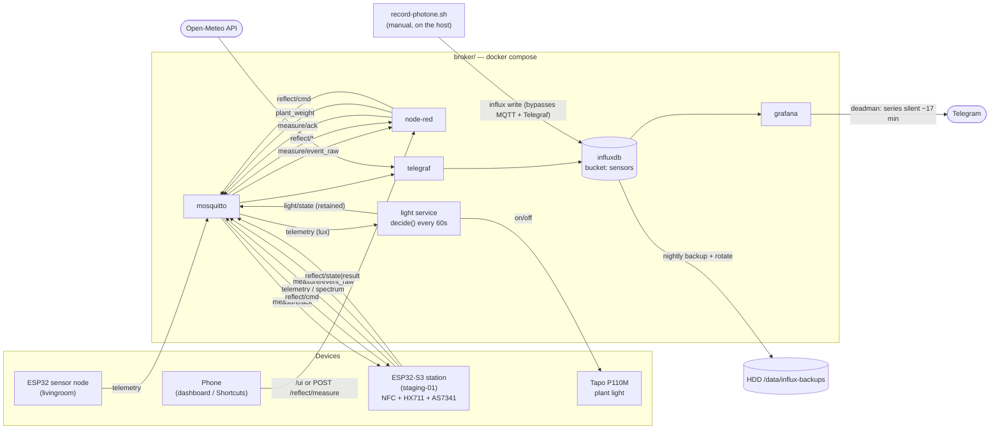

# Flows — every data path in monitor-air, and whether it is actually running

One place to answer "what talks to what, and is it live?". The per-subsystem docs stay
authoritative for their own details ([`README.md`](README.md), [`node-red/README.md`](node-red/README.md),
[`MEASUREMENT-STATION.md`](MEASUREMENT-STATION.md), [`PPFD-CALIBRATION.md`](PPFD-CALIBRATION.md));
this file is the index and the reality check.

> **Why the "Live?" column exists.** A diagram shows intent. This table is meant to show
> *fact* — a flow drawn here that isn't running is a bug in the system or a lie in the docs,
> and both are worth catching. Re-check it whenever you touch a pipeline (see
> [Verifying this file](#verifying-this-file)).

**Last verified: 2026-07-29.**

## The whole picture



See [Known gaps](#known-gaps) for what is defined but not yet proven on real hardware.

## A. Ingest — MQTT/HTTP → InfluxDB

1–5 are Telegraf inputs in [`telegraf/telegraf.conf`](telegraf/telegraf.conf). **6 is not** — it
writes to InfluxDB directly, bypassing MQTT and Telegraf entirely, so it is invisible to
anything that only reads the Telegraf config.

| # | Source | → measurement | Tags | Live? |
|---|---|---|---|---|
| 1 | `monitor-air/+/telemetry` | `air` | `device` | ✅ `livingroom`, `staging-01` |
| 2 | `monitor-air/+/light/state` | `light` | `location` ⚠️ not `device` | ✅ |
| 3 | `monitor-air/+/spectrum` | `spectrum` | `device`, `plant`, `mode` | ✅ |
| 4 | Open-Meteo HTTP (25.01, 121.46 — 板橋) | `weather` | `source`, `location`, `url` | ✅ |
| 5 | `monitor-air/+/plant_weight` | `plant_weight` | `device`, `plant_id` | ✅ deployed 2026-07-29, verified end-to-end |
| 6 | `record-photone.sh` → `influx write` | `photone` | `device`, `source`, `gain` | ✅ manual (35 points to date) |

Flow 6 also appends every reading to `photone-log.csv` as an audit copy, so that file and the
`photone` measurement are two views of the same write.

Flow 2 tags the topic's 2nd segment as **`location`**, not `device` — that segment is a room
(`livingroom`), not a device id. Queries that join `light` to `air` on `device` return nothing.

Telegraf subscribes to `plant_weight` and **never** to `measure/event_raw` — the device is
at-least-once, so consuming the raw topic would write ~5 points per measurement.

## B. Control loop — light

[`control/light.py`](control/light.py), one decision every 60 s.

Topics are built from env vars, **not hardcoded** — `LIGHT_SENSOR_DEVICE` (code default
`sensor-01`) and `LIGHT_LOCATION` (default `livingroom`). Both are set to `livingroom` in
`.env` today, which is why the two halves currently coincide.

| Direction | Topic | Note |
|---|---|---|
| in | `monitor-air/${LIGHT_SENSOR_DEVICE}/telemetry` | lux only |
| in | `monitor-air/${LIGHT_LOCATION}/light/cmd` | manual/AI override, suppresses auto for 5 min |
| out | `monitor-air/${LIGHT_LOCATION}/light/state` | retained |
| out | `monitor-air/${LIGHT_LOCATION}/light/availability` | retained LWT |
| out | Tapo P110M (local API) | on/off; auto decisions drive the plug directly, they do **not** round-trip through `cmd` |

`decide()`: ON below 5000 lx, OFF above 15000 lx, hysteresis + a `[ON_START, HARD_OFF)`
window, a DLI-based evening extension past `HARD_OFF` on dark days, and ≥5 min hold after any
switch. **On a stale/missing lux reading (>5 min) it does NOT simply fail off** — inside the
window an already-ON light is *held* on (this environment is light-deficient, so a dead sensor
shouldn't darken the plants); it goes OFF only if it was already off or the window has passed.
`light-ctl.sh` is the manual path — it publishes `light/cmd`. Live: ✅.

## C. On-demand measurement — Node-RED

Both tabs live in one [`node-red/flows.json`](node-red/flows.json). ⚠️ Flows run from the
`nodered-data` volume, **not** from the repo file — a repo edit is not live until you re-import
(see [`node-red/README.md`](node-red/README.md)).

**C1. Reflectance control** (tab `reflect-flow`) — Live: ✅

Phone `/ui` (pick plant → Measure) or `POST /reflect/measure?plant=X` → Node-RED generates the
`request_id` **server-side** and publishes a non-retained `reflect/cmd` → device measures →
`reflect/state|result|availability` come back. The server-side id is the whole point: the
firmware dedups by `request_id`, so a fixed-payload phone button would only ever get `dedup`.

**C2. Measurement station** (tab `station-flow`) — Live: ✅ (deployed 2026-07-29)

`measure/event_raw` → validate → **ack every copy** (the ESP retries 5×; the ack is what stops
it) → dedup on `(device, event_id)`, 60 s TTL → UID → `plant_id` via `tag-map.json` →
`plant_weight`. Unknown UID → `plant_id="unknown"` with the raw `uid` kept, never dropped.
Full contract: [`MEASUREMENT-STATION.md`](MEASUREMENT-STATION.md).

## D. Registration — how an identity gets defined

| Flow | Defines | Propagation |
|---|---|---|
| `./add-plant.sh <id>...` | the `plant` id domain (Node-RED dropdown) | the script does it all: rebuild + **volume reset** + up + verify (the fresh volume is re-seeded from the image, so there is no manual re-import) |
| `./add-tag.sh <plant-id>` | NFC UID → `plant_id` | bind-mounted, **live on the next weigh** |
| `./calibrate-ppfd.sh`, `./record-photone.sh` | lux/spectrum → PPFD calibration | see [`PPFD-CALIBRATION.md`](PPFD-CALIBRATION.md) |

`add-plant.sh` is the source of truth for plant ids; `add-tag.sh` validates against it, so a
tag can never point at a plant that doesn't exist. `plant_id` (weight) and `plant` (spectrum)
share one value domain on purpose — that is what lets the two join per plant.

## E. Operations

| Flow | What | Live? |
|---|---|---|
| Grafana deadman alert | per `(device, _field)` series silent >900 s, **then** `for: 2m` pending → Telegram fires ~17 min after the last point | ✅ |
| `backup/influx-backup.sh` | InfluxDB → `/data/influx-backups`, keeps newest 14 | ✅ cron `30 19 * * *` UTC = **03:30 Taipei** |
| `sim/publish.sh` | fake telemetry generator | ⛔ container `Exited` (intentional) |
| `start.sh` | bring the stack up | on demand |

## Known gaps

1. ~~Backups are not running.~~ **Scheduled 2026-07-29.** The documented cron line was never
   actually installed; `/data/influx-backups` held one 20 KB backup from 2026-06-15, taken
   when the database was nearly empty (1 shard, 653 B). Now installed and verified under a
   minimal `env -i` environment, the way cron will run it — today's backup is 13 MB across
   7 shards. Scheduled `30 19 * * *`: **cron follows the host timezone (UTC), not the
   containers' `TZ=Asia/Taipei`**, so 19:30 UTC is what actually lands at 03:30 Taipei.
2. ~~The weigh station is not deployed.~~ **Deployed 2026-07-29.** Telegraf recreated
   (4 consumers loaded), Node-RED image rebuilt + volume reset so `station-flow` seeded,
   Grafana picked the panel up on its own. Verified by publishing two copies of one event:
   both acked, exactly one `plant_weight` written, UID resolved to `cactus-01`, the point
   landed in InfluxDB (test point deleted afterwards). **Still untested with real hardware —
   a physical tag has not been tapped.**
3. **Single-file bind mounts are stale, and a restart will not fix them.** Docker binds a
   single-file mount by **inode**, so an editor that writes-new-then-renames silently detaches
   the container from the file. This has already happened to `telegraf.conf`:

   | | inode | mtime | `mqtt_consumer` count |
   |---|---|---|---|
   | host file | 44836170 | 2026-07-29 10:27 | 4 |
   | what the container sees | 44836847 | 2026-07-21 09:40 | 3 |

   Same path, different inode. `docker restart` keeps the old mount — only
   `docker compose up -d --force-recreate telegraf` (or `down`/`up`) reattaches. **Fixed for
   telegraf on 2026-07-29** by exactly that recreate; the table above is kept as the worked
   example because the trap will recur. The same trap applies to `node-red/tag-map.json`,
   which is why it must be edited **in place** by `add-tag.sh` and never by a rename-on-save
   editor.
4. **`docker compose build` fails on this host** — `~/.docker/buildx` is root-owned (from a
   2023 `sudo docker` run), so buildx cannot write its instance dir. Prefix builds with
   `DOCKER_BUILDKIT=0` (legacy builder) or `chown` the directory. This is silent-ish: compose
   prints the error but `up -d` then happily starts the **stale image**, which is how a volume
   reset can re-seed the old flow. `add-plant.sh` will hit this too.
5. **Two older diagrams are incomplete** — `../README.md` and `README.md` both draw the stack
   without Node-RED, so neither shows C1 or C2. Prefer this file.

## Verifying this file

The "Live?" column is a claim about the running system, so check it rather than trust it:

```bash
docker compose ps                                  # which services are actually up

# C: which flows the RUNNING Node-RED actually has. The bind-mount alone proves
# nothing — the flow lives in the nodered-data volume and must be imported.
docker exec monitor-air-nodered node -e "
  const f=require('/data/flows.json');
  for (const id of ['reflect-flow','station-flow'])
    console.log(id, f.some(n=>n.id===id))"

# A: consumers the running Telegraf loaded (its conf is bind-mounted, so a repo
# edit shows up here immediately but is NOT loaded until the container restarts —
# compare against the container's start time).
docker exec monitor-air-telegraf grep -c '^\[\[inputs.mqtt_consumer\]\]' /etc/telegraf/telegraf.conf
docker inspect -f '{{.State.StartedAt}}' monitor-air-telegraf

crontab -l | grep influx-backup                    # E: backups scheduled?
ls -t /data/influx-backups | head -1               # E: newest backup
```

For ingest, the honest check is InfluxDB itself — a pipeline is live only if points arrived.
Note flow 6 (`photone`) is manual and will be absent from a 24 h window; widen the range for it:

```bash
docker exec monitor-air-influxdb influx query --org monitor-air \
  'from(bucket:"sensors") |> range(start:-24h)
     |> group(columns:["_measurement"]) |> distinct(column:"_measurement")'
```
