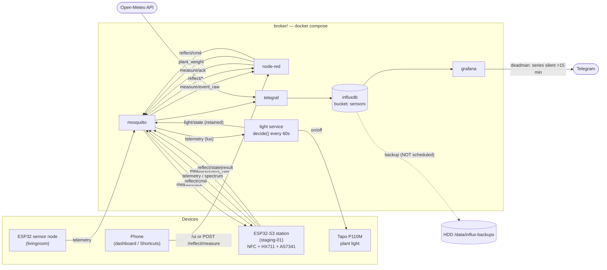

# Flows — every data path in monitor-air, and whether it is actually running

One place to answer "what talks to what, and is it live?". The per-subsystem docs stay
authoritative for their own details ([`README.md`](README.md), [`node-red/README.md`](node-red/README.md),
[`MEASUREMENT-STATION.md`](MEASUREMENT-STATION.md), [`PPFD-CALIBRATION.md`](PPFD-CALIBRATION.md));
this file is the index and the reality check.

> **Why the "Live?" column exists.** A diagram shows intent. This table is meant to show
> *fact* — a flow drawn here that isn't running is a bug in the system or a lie in the docs,
> and both are worth catching. Re-check it whenever you touch a pipeline (see
> [Verifying this file](#verifying-this-file)).

**Last verified: 2026-07-29.**

## The whole picture



Dotted = defined but not running. See [Known gaps](#known-gaps).

## A. Ingest — MQTT/HTTP → InfluxDB

All five are Telegraf inputs in [`telegraf/telegraf.conf`](telegraf/telegraf.conf); nothing else
writes to InfluxDB.

| # | Source | → measurement | Tags | Live? |
|---|---|---|---|---|
| 1 | `monitor-air/+/telemetry` | `air` | `device` | ✅ `livingroom`, `staging-01` |
| 2 | `monitor-air/+/light/state` | `light` | `device` | ✅ |
| 3 | `monitor-air/+/spectrum` | `spectrum` | `device`, `plant`, `mode` | ✅ |
| 4 | Open-Meteo HTTP (25.01, 121.46 — 板橋) | `weather` | — | ✅ |
| 5 | `monitor-air/+/plant_weight` | `plant_weight` | `device`, `plant_id` | ⛔ **config written, not deployed** |

Telegraf subscribes to `plant_weight` and **never** to `measure/event_raw` — the device is
at-least-once, so consuming the raw topic would write ~5 points per measurement.

## B. Control loop — light

[`control/light.py`](control/light.py), one decision every 60 s.

| Direction | Topic | Note |
|---|---|---|
| in | `monitor-air/livingroom/telemetry` | lux only; `LIGHT_SENSOR_DEVICE` |
| in | `monitor-air/livingroom/light/cmd` | manual/AI override, suppresses auto for 5 min |
| out | `monitor-air/livingroom/light/state` | retained |
| out | `monitor-air/livingroom/light/availability` | retained LWT |
| out | Tapo P110M (local API) | on/off |

`decide()`: ON below 5000 lx, OFF above 15000 lx, hysteresis + a `[ON_START, HARD_OFF)`
window, a DLI-based evening extension, ≥5 min hold after any switch, and **fail-safe OFF if
lux is older than 5 min**. `light-ctl.sh` is the manual path — it publishes `light/cmd`.
Live: ✅.

## C. On-demand measurement — Node-RED

Both tabs live in one [`node-red/flows.json`](node-red/flows.json). ⚠️ Flows run from the
`nodered-data` volume, **not** from the repo file — a repo edit is not live until you re-import
(see [`node-red/README.md`](node-red/README.md)).

**C1. Reflectance control** (tab `reflect-flow`) — Live: ✅

Phone `/ui` (pick plant → Measure) or `POST /reflect/measure?plant=X` → Node-RED generates the
`request_id` **server-side** and publishes a non-retained `reflect/cmd` → device measures →
`reflect/state|result|availability` come back. The server-side id is the whole point: the
firmware dedups by `request_id`, so a fixed-payload phone button would only ever get `dedup`.

**C2. Measurement station** (tab `station-flow`) — Live: ⛔ **not deployed**

`measure/event_raw` → validate → **ack every copy** (the ESP retries 5×; the ack is what stops
it) → dedup on `(device, event_id)`, 60 s TTL → UID → `plant_id` via `tag-map.json` →
`plant_weight`. Unknown UID → `plant_id="unknown"` with the raw `uid` kept, never dropped.
Full contract: [`MEASUREMENT-STATION.md`](MEASUREMENT-STATION.md).

## D. Registration — how an identity gets defined

| Flow | Defines | Propagation |
|---|---|---|
| `./add-plant.sh <id>...` | the `plant` id domain (Node-RED dropdown) | rebuild + **volume reset** + re-import |
| `./add-tag.sh <plant-id>` | NFC UID → `plant_id` | bind-mounted, **live on the next weigh** |
| `./calibrate-ppfd.sh`, `./record-photone.sh` | lux/spectrum → PPFD calibration | see [`PPFD-CALIBRATION.md`](PPFD-CALIBRATION.md) |

`add-plant.sh` is the source of truth for plant ids; `add-tag.sh` validates against it, so a
tag can never point at a plant that doesn't exist. `plant_id` (weight) and `plant` (spectrum)
share one value domain on purpose — that is what lets the two join per plant.

## E. Operations

| Flow | What | Live? |
|---|---|---|
| Grafana deadman alert | per `(device, _field)` series silent >15 min → Telegram | ✅ |
| `backup/influx-backup.sh` | InfluxDB → `/data/influx-backups`, keeps newest 14 | ⛔ **not scheduled** |
| `sim/publish.sh` | fake telemetry generator | ⛔ container `Exited` (intentional) |
| `start.sh` | bring the stack up | on demand |

## Known gaps

1. **Backups are not running.** `README.md` documents a `30 3 * * *` cron line, but no such
   entry exists in `crontab -l`, there is no `backup/backup.log`, and the newest backup in
   `/data/influx-backups` is `2026-06-15_090629`. The script works — it was run once by hand
   and never scheduled. **Install the cron line or delete the claim.**
2. **The weigh station is not deployed.** The running `node-red` container predates the
   station flow and has no `tag-map.json` mount; `telegraf` still runs the pre-`plant_weight`
   config. Needs `docker compose up -d` + a one-time flow import, then a real tap to verify.
3. **Two older diagrams are incomplete** — `../README.md` and `README.md` both draw the stack
   without Node-RED, so neither shows C1 or C2. Prefer this file.

## Verifying this file

The "Live?" column is a claim about the running system, so check it rather than trust it:

```bash
docker compose ps                                  # which services are actually up
docker inspect monitor-air-nodered --format '{{range .Mounts}}{{.Destination}} {{end}}'
                                                   # /data/tag-map.json present => C2 deployed
grep -c mqtt_consumer telegraf/telegraf.conf       # vs. what the running telegraf loaded
crontab -l | grep influx-backup                    # E: backups scheduled?
ls -t /data/influx-backups | head -1               # E: newest backup
```

For ingest, the honest check is InfluxDB itself — a pipeline is live only if points arrived:

```bash
docker exec monitor-air-influxdb influx query --org monitor-air \
  'from(bucket:"sensors") |> range(start:-24h)
     |> group(columns:["_measurement"]) |> distinct(column:"_measurement")'
```
