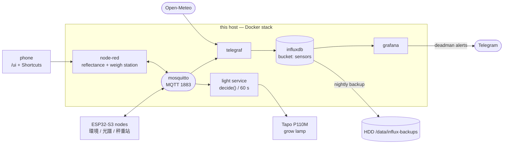

# monitor-air server stack

The server side of `monitor-air`, run via Docker Compose. This page covers the
**services** — what runs, how to operate it. For **data paths** — what flows where,
and whether each one is actually alive right now — see
[`FLOWS.md`](FLOWS.md), which is the single owner of that picture. It used to be
drawn here too, and the two copies drifted apart.



| Service    | Role                                   | Address                         |
|------------|----------------------------------------|---------------------------------|
| mosquitto  | MQTT broker (devices publish here)     | `<host>:1883`                   |
| influxdb   | time-series storage (bucket `sensors`) | `127.0.0.1:8086` (localhost)    |
| telegraf   | MQTT → InfluxDB bridge (no code)       | internal                        |
| grafana    | charts / dashboards                    | `http://<host>:3001`            |
| light      | plant-light controller (lux → P110M)   | internal                        |
| node-red   | phone reflectance control (`/ui` + HTTP) | `127.0.0.1:1880` (localhost)  |
| sim        | synthetic publisher (optional)         | internal, `--profile sim`       |

> **Note:** Grafana is mapped to host port **3001** (host `3000` was already
> taken on this machine). Change the `grafana` port mapping in
> `docker-compose.yml` if you want a different one.

## First-time setup

```bash
# 1. backup target on the HDD (owned by uid 1000 so the influx container can write)
mkdir -p /data/influx-backups          # use sudo + chown 1000:1000 if not already yours

# 2. secrets
cd broker
cp .env.example .env
#    edit .env — set passwords and a strong token:
#      DOCKER_INFLUXDB_INIT_ADMIN_TOKEN=$(openssl rand -hex 32)

# 3. bring up the stack
docker compose up -d
docker compose ps                       # influxdb should be "healthy"
```

InfluxDB's `DOCKER_INFLUXDB_INIT_*` vars are **only applied on the very first
start** (empty `influxdb-data` volume). To change org/bucket/token afterwards
you must `docker compose down -v` (this wipes the DB).

## Run / operate

| Action               | Command                                       |
|----------------------|-----------------------------------------------|
| Status               | `docker compose ps`                           |
| Logs                 | `docker compose logs -f telegraf` (etc.)      |
| Stop (keep data)     | `docker compose down`                         |
| Stop + wipe all data | `docker compose down -v`                      |

## Synthetic data (for testing without the ESP32)

```bash
docker compose --profile sim up -d sim      # start fake publisher
docker compose logs -f sim                  # watch it publish
docker compose stop sim                      # stop it
```

The sim publishes to `monitor-air/sim/telemetry`. Its points carry the tag
`device=sim`, so you can delete them later:

```bash
docker compose exec -T influxdb influx delete --bucket sensors \
  --org monitor-air --token "$DOCKER_INFLUXDB_INIT_ADMIN_TOKEN" \
  --start 1970-01-01T00:00:00Z --stop 2100-01-01T00:00:00Z \
  --predicate 'device="sim"'
```

## Data contract (the firmware must follow this)

- **Topic:** `monitor-air/<device>/telemetry` (e.g. `monitor-air/sensor-01/telemetry`)
- **Payload (JSON, all values floats):**
  ```json
  {"temp":24.8,"hum":51.2,"pressure":1009.3,"gas":12.4,"lux":350.0,"lux_ref":8.1}
  ```
  Keep every field a float (`lux:350.0`, not `350`) — InfluxDB fixes a field's
  type on first write, and int/float drift causes partial write failures.
  A sensor that fails to read omits its field rather than sending null.

`lux` is the BH1750 at the plant (sees the grow lamp); `lux_ref` is a second,
shielded BH1750 beside it (ambient only). `lux - lux_ref` is the lamp's own
contribution.

Telegraf maps this to measurement `air`, tag `device` (2nd topic segment), and
one float field per key.

`telemetry` is not the only topic — `spectrum`, `reflect/*` and `measure/*` have
their own contracts. [`FLOWS.md`](FLOWS.md) lists every one with its measurement
and tags; [`MEASUREMENT-STATION.md`](MEASUREMENT-STATION.md) has the weigh-station
contract in full.

## Plant-light control

The `light` service reads `lux` from telemetry and switches a **Tapo P110M**
plug (the plant light). The ESP32 knows nothing about the plug — it only
reports lux. Decisions run here on a 60 s tick.

**The rule.** Inside a local-time window (`ON_START`–`HARD_OFF`, default
08:00–18:30) turn on when it is dark (`lux < LUX_ON_BELOW`), off when it is bright
(`lux > LUX_OFF_ABOVE`), and hold between the two so it cannot flap. Outside the
window: off. A switch is held for `MIN_HOLD` before it can flip again.

**Evening top-up.** After `HARD_OFF`, keep supplementing until the day's
accumulated DLI reaches `DLI_TARGET`, capped at `LIGHT_EXTEND_END_MIN` (20:30).
Re-checked every tick, so the lamp stops the moment the target is met rather than
running blind to the cap. This replaced an earlier "was today dark?" threshold,
which could not work here: natural light measures 1–2 % of the daily total, so the
answer was the same every day. Derive `DLI_TARGET` from your own measured baseline
— `lux/54` is a daylight conversion applied to an LED, so the absolute scale is not
trustworthy.

**On a stale or missing lux reading it does NOT simply fail off.** Inside the
window the lamp *runs*, regardless of what it was doing before; outside it, off.
This environment is light-deficient, so a dead sensor must not darken the plants.

It used to *hold* an already-ON lamp but never start a stopped one, and that
asymmetry cost real plant-days: both BH1750s died at 20:58 on 2026-08-10, after the
lamp had already switched off for the evening — so every morning afterwards it was
never started, silently and indefinitely. Do not "restore" the old behaviour.

All knobs (`LUX_ON_BELOW`, `LUX_OFF_ABOVE`, `ON_START`, `HARD_OFF`, `MIN_HOLD`,
`STALE`, …) live at the top of `control/light.py`; the window and `DLI_TARGET`
come from `.env`.

**Topics** (`<loc>` = `LIGHT_LOCATION`):

| Topic | Payload | Notes |
|-------|---------|-------|
| `monitor-air/<loc>/light/cmd` | `{"state":"ON"\|"OFF"}` | **external override seam** — publish here to drive the plug manually / from an AI agent (holds off auto for `MANUAL_HOLD`). Not retained. |
| `monitor-air/<loc>/light/state` | `{"state":"ON","on":1,"source":"auto"}` | retained; `on` is charted in Grafana (measurement `light`). |
| `monitor-air/<loc>/light/availability` | `online`/`offline` | retained + MQTT LWT. |

**Config** (`.env`, see `.env.example`): `TAPO_EMAIL`, `TAPO_PASSWORD`,
`TAPO_IP`, `LIGHT_LOCATION`, `LIGHT_SENSOR_DEVICE`, `LIGHT_TZ`, `MQTT_HOST`.

```bash
docker compose up -d --build light            # start it
docker compose run --rm light python /light.py --selftest   # check decide() logic
# manual switch (via the MQTT command seam — pauses auto control ~2h):
./light-ctl.sh on        # or: off | status
```

## Viewing charts

Open `http://<host>:3001`, log in (`admin` / your `GF_SECURITY_ADMIN_PASSWORD`).
The InfluxDB datasource and both dashboards are auto-provisioned (datasource uid
`influxdb-monitor-air`); the provider watches the whole
`grafana/provisioning/dashboards/` directory, so adding a `.json` there is all it
takes to add a dashboard — no config change, no restart.

| Dashboard | Grain | For |
|---|---|---|
| **monitor-air** | live, `now-24h` | is it working right now — sensor freshness, temp/hum/pressure/gas/light, spectrum, PPFD, reflectance, plant weight |
| **monitor-air — daily** | one point per local day, `now-30d` | what happened each day — weight per plant and its day-over-day change, DLI, outdoor context, when the lamp switched off, and per-pipeline ingest completeness |

⚠️ Every `aggregateWindow(every: 1d)` must carry `import "timezone"` +
`option location = timezone.location(name: "Asia/Taipei")`. Without it the day
boundary is UTC midnight — 08:00 local — which cuts straight through a working
day. The charts still render; every number is just misfiled.

The **AS7341 spectrum** panel shows the latest 8-channel ambient spectrum
(f415 violet → f680 red, raw counts) from the `spectrum` measurement. Telegraf
ingests `monitor-air/+/spectrum` (separate from the `air` telemetry contract):
numeric fields, with `device`, `mode` (ambient/reflect) and `plant` tags.

The **Leaf reflectance** panel shows each plant's most recent reflectance
measurement (triggered from the Node-RED `/ui` on your phone): `net_*` =
LED-lit counts minus ambient leak, grouped by wavelength with one colour per
plant. Raw counts — compare spectral *shapes* between plants or over time for
the same plant, not absolute values.

### Plant registry

Plant ids are permanent (they live forever as InfluxDB tags): `cactus-NN`
zero-padded, sub-numbered `cactus-NN-M` when one pot holds several plants.
**Never reuse a retired id** — a dead plant's history must not mix with its
successor's. `white-ref` is the white-reference target, not a plant. Pots are
physically labelled with their id. To add a plant:

```bash
./add-plant.sh cactus-14            # or several: ./add-plant.sh cactus-14 cactus-15-1
git add node-red/flows.json && git commit
```

The script validates the id (firmware rule `[A-Za-z0-9_-]{1,40}`), skips
duplicates, keeps `*-ref` entries last, and does the full redeploy dance
(rebuild + volume reset — see Dockerfile note). Everything downstream
(firmware echo, Telegraf `plant` tag, Grafana panel) adapts automatically.

Current: `cactus-01` … `cactus-12` (one per pot), `cactus-13-1/-2/-3`
(pot 13 holds three), `white-ref`. Species/location notes can be filled in
here as needed.

The **DLI** panel estimates the Daily Light Integral (mol/m²/day) over the last
7 local days by integrating `PPFD ≈ lux / 54` per day. This is a daylight-spectrum
approximation, **not** a true PAR measurement; lux dropouts undercount, and
today's bar is partial.

The **PPFD (spectrum-derived)** panel is the real-PAR replacement: instantaneous
`PPFD ≈ CAL · Σ(countᵢ / Rᵢ · λᵢ)` over the AS7341's 8 PAR-band channels. Each
count is first normalized by that channel's **datasheet irradiance responsivity
`Rᵢ`** (warm-white 2700K @ 107.67 µW/cm²: F1=55, F2=110, F3=210, F4=390, F5=590,
F6=840, F7=1350, F8=1070 — the channels differ ~25× in sensitivity, so skipping
this badly overweights yellow/red), then **photon-weighted by `λ`**. Gain and
integration scale all channels equally, so they fold into `CAL`. The **spectral
shape is physically corrected; the absolute scale is calibrated for daylight
only** — `CAL = 0.0017469`, derived against a co-located BH1750 in daylight (see
[`PPFD-CALIBRATION.md`](PPFD-CALIBRATION.md)). Under the grow lamp it is still
wrong and the correction factor is unresolved; that is what
[`PHOTONE-CAL-PLAN.md`](PHOTONE-CAL-PLAN.md) exists to settle. Recalibrate with
`CAL_new = CAL_old · (PPFD_meter / shown value)`.

Both the `lux/54` DLI and the spectrum DLI are charted side by side, the former
labelled LEGACY. Note that the light controller's evening top-up decides against
the **lux estimate**, not the spectrum one.

## Monitoring / device health

The top table shows **seconds since each `device × field` last reported** — one
row per device, one column per sensor field, populated automatically by grouping
on the `device` tag and `_field` (no per-device config). Green < 3 min, red > 5
min (aligned with the controller's `STALE`). A single red cell with green
neighbours means **that sensor dropped** (e.g. the BH1750 lux field cutting out
while the BME680 keeps reporting); a **whole red row** means the device is
offline. This catches per-field dropouts that the time-series panels hide.

> **Keep the firmware contract:** on a sensor read failure, **omit** that field
> from the JSON rather than sending `0`/a fake value — omission is what makes a
> dropout detectable here.

### Deadman alert (Telegram)

Three provisioned rules in the folder **Device health**:

| Rule | Fires when | Pending |
|---|---|---|
| `deadman-sensor-stale` | a `(device, field)` series is silent **>15 min** | `for: 2m` → ~17 min after the last point |
| `deadman-weather-stale` | the Open-Meteo feed is silent **>60 min** | `for: 10m` |
| `alert-delivery-failing` | Grafana's own notification-failure counter rose in the last hour | `for: 5m` |

Both staleness queries report the age in **minutes**, so the thresholds read in the
same unit as the notification text. That is not cosmetic: Grafana's notification
template engine has no `humanizeDuration` (11.1.0 answers `function
"humanizeDuration" not defined`), so a seconds-valued query cannot be turned into
readable prose downstream. Change one, change the other.

The sensor rule covers all current and future devices/fields automatically. The
weather rule is separate because the cadence differs by two orders of magnitude,
and it collapses the whole feed to **one** alert instance — the six weather fields
arrive in a single JSON object, so per-field alerting would send six messages for
one outage.

Exclusions in the sensor rule, each with a reason:

- `sim` — the synthetic publisher.
- `staging-01` — the bench board. It runs only while someone is developing on it,
  so silence is its normal state.
- `weight_raw` — weight became event-driven with the weigh station, so a gap means
  nobody weighed anything, not that the scale died.
- `lux` / `lux_ref` — watched **only inside the plant-light window**. The BH1750
  stops reporting in darkness, which is normal.

> **This alert silently did nothing for weeks.** The query dropped `_time`, so
> Grafana saw NoData — and `noDataState: OK` reported that as healthy. Both are
> fixed (`noDataState: NoData` now, so the rule can report its own failure), but
> the lesson generalises: verifying that a rule *loads* is not verifying that it
> *fires*. Test by pointing it at a series you know is stale and watching for the
> Telegram message. `FLOWS.md` gap 5 has the full post-mortem.

**The window is a single shared parameter**: `LIGHT_WINDOW_START_MIN` /
`LIGHT_WINDOW_END_MIN` in `.env` (minutes since midnight; 480=08:00,
1110=18:30) drive **both** the light controller's ON/HARD_OFF window and this
alert gate. Grafana's alerting provisioning can't interpolate env vars, so the
rule lives in git as `provisioning/alerting/rules.yaml.tmpl` and **`start.sh`
renders** the actual (gitignored) `rules.yaml` from it. After changing the
window in `.env`: run `bash start.sh`, then restart the consumers
(`docker compose up -d --force-recreate light grafana`). On a fresh clone,
Grafana has no alert rule until `start.sh` has rendered it once.

Telegram delivery is configured via Grafana's API (not file provisioning, which
mis-types a numeric chat id). One-time setup:

```bash
# 1. create a bot with @BotFather → bot token; get your numeric chat id by
#    messaging the bot then GET https://api.telegram.org/bot<token>/getUpdates
# 2. put both in broker/.env:
#      TELEGRAM_BOT_TOKEN=...
#      TELEGRAM_CHAT_ID=...
# 3. wire up the contact point + route (idempotent; re-run after a token change):
bash grafana/setup-telegram.sh
# 4. test delivery:
curl -s "https://api.telegram.org/bot$TELEGRAM_BOT_TOKEN/sendMessage" \
  -d chat_id=$TELEGRAM_CHAT_ID -d text=monitor-air-test
```

The rule is declarative (in git); the contact point + route live in Grafana's DB
(created by the script, so the bot token never enters version control).

**Set `GF_SERVER_ROOT_URL` in `.env` to an address the reader's phone can reach**
(e.g. `http://192.168.1.52:3001/`). Grafana builds every link in every
notification from it, and unset it defaults to `http://localhost:3000/` — the
wrong port, since the container maps `3001:3000`, and on a phone `localhost` is
the phone. Until it is set, every link in every alert is dead.

**What the notification looks like** is decided in two places, on purpose:

- the **rules** own the prose. `summary` is the headline, `description` carries
  the number, its unit and the action. Only the rule knows the unit, so only the
  rule can write the sentence.
- the **contact point** owns the layout — the `message` template in
  `setup-telegram.sh`, which renders summary + description + link and nothing
  else.

Without that `message`, Grafana falls back to `default.message`: every label
dumped as `- k = v`, plus `Value: B=22, C=1` where `C` is the threshold
expression's own boolean, and the Silence link as 400 characters of URL-encoded
matchers. The first 100 characters — all Telegram shows in a push preview — were
metadata, and the actionable line came last. The template also emits **plain
text**, which sidesteps `parse_mode` entirely (the default is HTML, so the
`**Firing**` in Grafana's stock template arrives as literal asterisks).

Notifications group by `(alertname, device)`: one message listing every dead
field on a board, rather than six messages for one unplugged sensor.

## Backups (to the HDD)

Live data sits on the SSD (named volume `influxdb-data`); backups go to the HDD
at `/data/influx-backups`.

```bash
bash broker/backup/influx-backup.sh        # one-off backup + rotation (keeps newest 14)
```

Schedule a daily backup via cron (`crontab -e`):

```cron
# InfluxDB -> HDD daily backup + rotation
# 19:30 UTC = 03:30 Asia/Taipei (this host runs UTC — check `timedatectl` on yours)
30 19 * * * "$HOME"/monitor-air/broker/backup/influx-backup.sh >> "$HOME"/monitor-air/broker/backup/backup.log 2>&1
```

**cron uses the host's timezone, not the containers'** — the compose services are
`TZ=Asia/Taipei` but the host is UTC, so a naive `30 3` would run at 11:30 local.

The script resolves its own path, loads `broker/.env`, and is safe under cron's
minimal environment (verified with `env -i HOME=... PATH=/usr/bin:/bin`). Tune
retention with `KEEP=30 bash .../influx-backup.sh`. Check it ran:
`tail broker/backup/backup.log` and `ls -t /data/influx-backups | head -1`.

## Storage rationale

InfluxDB does many small random writes (WAL + compactions) → it belongs on the
**SSD**. A year of this single sensor compresses to well under a few hundred MB,
so the HDD's capacity isn't needed for the live DB. The **HDD** is used for
periodic backups (bulk sequential writes, off the primary disk).

## Security note

Mosquitto is anonymous-open and Grafana/InfluxDB use the passwords in `.env` —
fine for an isolated LAN. Before exposing anything beyond the LAN, add MQTT
auth (see below), put Grafana behind TLS, and rotate the InfluxDB token.

### Locking down MQTT later

The broker mounts `config` read-only, so generate the password file on the host:

```bash
docker run --rm -it -v "$PWD/config:/c" eclipse-mosquitto:2 \
  mosquitto_passwd -c /c/passwd <username>
```

Then set in `config/mosquitto.conf`:

```conf
allow_anonymous false
password_file /mosquitto/config/passwd
```

and `docker compose restart mosquitto`.
